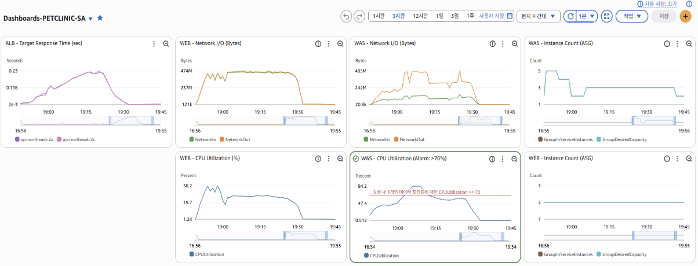
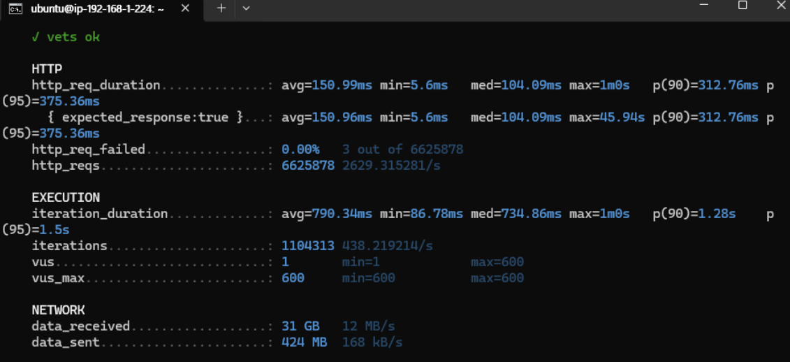

# AWS High Availability 3-Tier Web Infrastructure

> AWS 기반의 고가용성 3-Tier(Web-WAS-DB) 아키텍처를 구축하고, Apache HTTP Server, Apache Tomcat, Amazon RDS를 연계하여 Spring PetClinic 애플리케이션을 배포한 팀 프로젝트입니다.

<div align="center">


</div>

---

# Project Overview

## Background

웹 서비스는 단순히 애플리케이션을 실행하는 것만으로는 안정적인 서비스 운영이 어렵습니다.

실제 운영 환경에서는

* 안정적인 트래픽 분산
* 장애 발생 시 서비스 지속성
* 보안
* 확장성
* 운영 모니터링

등을 함께 고려한 인프라 설계가 필요합니다.

본 프로젝트에서는 AWS 환경에서 **High Availability 3-Tier Architecture**를 구축하고, Apache HTTP Server, Apache Tomcat, Amazon RDS를 연동하여 Spring PetClinic 서비스를 운영 가능한 형태로 배포하는 것을 목표로 하였습니다.

또한 Auto Scaling, CloudWatch, Load Balancer 등을 적용하여 운영 환경에서 요구되는 확장성, 가용성 및 모니터링을 고려한 인프라를 구현하였습니다.

---

# Project Goals

* AWS 기반 3-Tier 아키텍처 구축
* Web / WAS / DB 계층 분리
* Reverse Proxy 기반 Apache-Tomcat 연동
* ALB/NLB 기반 트래픽 분산
* Auto Scaling 기반 확장성 확보
* CloudWatch 기반 운영 모니터링
* Spring PetClinic 애플리케이션 배포

---

# Project Information

| Category | Description |
|----------|-------------|
| Project | AWS High Availability 3-Tier Infrastructure |
| Type | Team Project (5 Members) |
| Duration | 3 Weeks |
| Domain | Cloud Infrastructure |
| Environment | AWS |

---

# My Contributions

## Infrastructure

* AWS IAM 사용자 및 권한 정책 구성
* AWS 3-Tier(Web-WAS-DB) 인프라 구축
* Apache HTTP Server 구축
* Apache Reverse Proxy 구성
* Apache HTTP Server ↔ Apache Tomcat 연동
* ALB 및 NLB 구성 및 연동
* Spring PetClinic 애플리케이션 배포

## Monitoring & Reliability

* CloudWatch 기반 운영 모니터링
* Auto Scaling 구성 및 동작 검증
* Health Check 기반 서비스 상태 확인
* 부하 테스트를 통한 서비스 안정성 검증

## Team Management

* 프로젝트 일정 관리
* 인프라 구축 일정 조율
* 팀원 역할 분배
* 프로젝트 최종 통합 테스트 및 발표

---

# Key Features

## High Availability

* Multi-AZ 기반 인프라 구성
* Application Load Balancer
* Network Load Balancer
* Auto Scaling
* Health Check

---

## Security

* IAM 기반 접근 제어
* Security Group 구성
* Private Subnet 기반 WAS / DB 분리
* Session Manager 기반 안전한 서버 접근
* Secrets Manager를 활용한 민감 정보 관리

> Session Manager와 Secrets Manager는 프로젝트 전체 인프라 구성의 일부로 팀 협업을 통해 적용하였습니다.

---

## Monitoring

* Amazon CloudWatch
* Health Check
* Auto Scaling 상태 모니터링 
* EC2 리소스 모니터링

---

## Deployment

* Spring PetClinic 애플리케이션 배포
* Apache Reverse Proxy 기반 서비스 요청 라우팅
* Amazon RDS 기반 데이터베이스 연동

---

# Tech Stack

## Cloud

* AWS EC2
* Amazon RDS
* IAM
* CloudWatch
* Auto Scaling
* Route53
* CloudFront

---

## Networking

* Amazon VPC
* Public / Private Subnet
* Internet Gateway
* NAT Gateway
* Route Table
* Security Group
* Application Load Balancer (ALB)
* Network Load Balancer (NLB)

---

## Operations

* AWS Systems Manager Session Manager
* AWS Secrets Manager

---

## Web

* Apache HTTP Server 2.4
* Reverse Proxy

---

## WAS

* Apache Tomcat 9
* Java 8 (Amazon Corretto)
* Maven

---

## Database

* Amazon RDS (MySQL)

---

# Architecture

> **Architecture Diagram**


---

# Monitoring

> **CloudWatch Dashboard**



CloudWatch Dashboard를 구축하여 EC2 CPU 사용률, Network I/O,
Application Load Balancer 응답 시간, Auto Scaling 상태 등을 실시간으로 모니터링하였습니다.

---

# Performance Validation

> **Load Test (k6)**



k6를 이용한 부하 테스트를 수행하여 Auto Scaling 정책과 서비스 안정성을 검증하였습니다.

---

# Service Flow

```text
User

↓

Route53

↓

CloudFront

↓

Application Load Balancer

↓

Apache HTTP Server (Reverse Proxy)

↓

Network Load Balancer

↓

Apache Tomcat

↓

Amazon RDS
```

Application Load Balancer를 통해 수신된 요청은 Apache HTTP Server(Reverse Proxy)에서 처리된 후,
Network Load Balancer를 거쳐 Apache Tomcat으로 전달됩니다.

Apache Tomcat은 Amazon RDS와 연동하여 데이터를 처리하며,
Auto Scaling을 통해 확장성을 확보하고 CloudWatch를 이용하여 서비스 상태와 리소스를 지속적으로 모니터링하였습니다.

---

# Lessons Learned

- 3-Tier Architecture를 직접 구축하며 계층 분리와 네트워크 흐름을 이해할 수 있었다.
- Auto Scaling과 CloudWatch를 적용하여 운영 환경에서의 확장성과 모니터링의 중요성을 경험하였다.
- 인프라 구축뿐 아니라 운영 및 성능 검증까지 수행하며 실제 서비스 환경을 고려한 시스템 설계 경험을 쌓을 수 있었다.
- 팀 프로젝트를 진행하며 인프라 구축뿐 아니라 역할 분담, 일정 관리 및 협업의 중요성을 경험하였다.